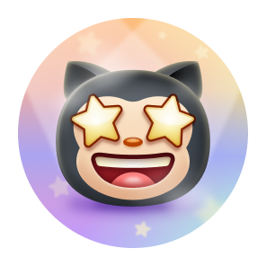
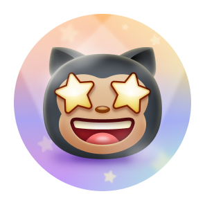

# 🏆 GitHub Achievements & Badges Guide 🏆

Welcome to the GitHub Achievements repository! Here you'll find everything you need to know about **GitHub Badges**, including how to earn them, what they mean, and more. GitHub introduced badges to celebrate various milestones and contributions made to open source projects and the platform.

---

## 📈 Overview of GitHub Badges

GitHub offers a variety of badges to celebrate your contributions, engagement, and community-building efforts. These badges can be displayed on your GitHub profile and are available based on different activities like merging pull requests, creating discussions, and much more.

### **How to Earn GitHub Badges**

To earn badges, you need to:

- **Contribute to Open Source**: Create or contribute to repositories that have significant community engagement.
- **Engage in Community Activities**: Participate in discussions, close issues, and co-author commits.
- **Showcase Unique Skills**: Achieve milestones such as merging pull requests or providing helpful answers.

### **Types of GitHub Badges**

There are various badges, each representing a different achievement. They come in different colors and levels, from default to gold, depending on the frequency or scale of your activity. Additionally, some badges come in multiple **skin tones** to align with GitHub's emoji skin tone preferences.

---

## 🏅 Displaying Achievements

You can opt to **show or hide** these achievements on your GitHub profile. By default, they are visible to anyone who visits your public profile. If you prefer not to display them, you can modify this setting in your [GitHub Profile Settings](https://github.com/settings).

---

## 📃 Achievement List

Below is a list of some of the key **GitHub Badges** you can earn and how to get them:

| Badge | Name | How to Earn | Levels (Default, Bronze, Silver, Gold) |
|:-:|:-:|:-:|:-:|
|  | Heart On Your Sleeve | (TBD) |  |
|  | Open Sourcerer | (TBD) |  |
|  | Starstruck | Created a repository with many stars | 16 (Bronze), 128 (Silver), 512 (Gold) |
|  | Quickdraw | Closed an issue/pull request within 5 minutes of opening | 1 (Default) |
|  | Pair Extraordinaire | Coauthored a merged commit | 1 (Default), 10 (Bronze), 24 (Silver), 48 (Gold) |
|  | Pull Shark | Opened a merged pull request | 2 (Default), 16 (Bronze), 128 (Silver), 1024 (Gold) |
|  | Galaxy Brain | Answered a discussion and got an accepted answer | 2 (Default), 8 (Bronze), 16 (Silver), 32 (Gold) |
|  | YOLO | Merged a pull request without a review | 1 (Default) |
|  | Public Sponsor | Sponsored an open-source contributor through GitHub Sponsors | 1 (Default) |

---

## 👋 Badge Skin Tones

GitHub badges can also be customized with **skin tone preferences** for certain achievements. Your skin tone preference impacts how certain badges will appear on your profile.

You can set your **preferred skin tone** in your [GitHub Appearance Settings](https://github.com/settings/appearance). Below are some badges that support skin tone versions:

| Badge | Name |                                                                                                                                                                                                                                                                                                                                                                                                                                                                                                                                            Skin Tone Versions                                                                                                                                                                                                                                                                                                                                                                                                                                                                                                                                            | 
| :-: | :-: |:--------------------------------------------------------------------------------------------------------------------------------------------------------------------------------------------------------------------------------------------------------------------------------------------------------------------------------------------------------------------------------------------------------------------------------------------------------------------------------------------------------------------------------------------------------------------------------------------------------------------------------------------------------------------------------------------------------------------------------------------------------------------------------------------------------------------------------------------------------------------------------------------------------------------------------------------------------------------------------------------------------------------------------------------------------------------------------------------------------:|
|                  | Starstruck         | <table>  <tbody>  <tr>  <td align="center"></td>   <td align="center"></td>  <td align="center"></td>  <td align="center"></td>  <td align="center"></td>   <td align="center"></td>   </tr>   <tr>  <td align="center">👋</td> <td align="center">👋🏻</td>  <td align="center">👋🏼</td>  <td align="center">👋🏽</td>  <td align="center">👋🏾</td>  <td align="center">👋🏿</td>  </tr>  </tbody>  </table> |
|                  | Quickdraw         |       <table>  <tbody>  <tr>  <td align="center"></td>   <td align="center"></td>  <td align="center"></td>  <td align="center"></td>  <td align="center"></td>   <td align="center"></td>   </tr>   <tr>  <td align="center">👋</td> <td align="center">👋🏻</td>  <td align="center">👋🏼</td>  <td align="center">👋🏽</td>  <td align="center">👋🏾</td>  <td align="center">👋🏿</td>  </tr>  </tbody>  </table>       |

---

## ✨ Highlight Badges

In addition to standard badges, GitHub offers special **highlight badges** to mark participation in certain exclusive programs:

<table>
  <tr>
    <td>
      <picture>
        <source media="(prefers-color-scheme: dark)" srcset="https://raw.githubusercontent.com/kavicastelo/Github-Achivements/refs/heads/main/Media/Highlights/GitHub-Pro/SVG/GitHub-Pro_LightMode.svg" />
        <source media="(prefers-color-scheme: light)" srcset="https://raw.githubusercontent.com/kavicastelo/Github-Achivements/refs/heads/main/Media/Highlights/GitHub-Pro/SVG/GitHub-Pro_DarkMode.svg" />
        
      </picture>
    </td>
    <td>GitHub Pro</td>
    <td>Use GitHub Pro</td>
  </tr>
  <tr>
    <td>
      <picture>
        <source media="(prefers-color-scheme: dark)" srcset="https://raw.githubusercontent.com/kavicastelo/Github-Achivements/refs/heads/main/Media/Highlights/Developer-Program-Member/SVG/DeveloperProgramMember_LightMode.svg" />
        <source media="(prefers-color-scheme: light)" srcset="https://raw.githubusercontent.com/kavicastelo/Github-Achivements/refs/heads/main/Media/Highlights/Developer-Program-Member/SVG/DeveloperProgramMember_DarkMode.svg" />
        
      </picture>
    </td>
    <td>Developer Program Member</td>
    <td>Register for the GitHub Developer Program</td>
  </tr>
  <tr>
    <td>
      <picture>
        <source media="(prefers-color-scheme: dark)" srcset="https://raw.githubusercontent.com/kavicastelo/Github-Achivements/refs/heads/main/Media/Highlights/Security-Advisory-Credit/SVG/Security-Advisory-Credit_LightMode.svg" />
        <source media="(prefers-color-scheme: light)" srcset="https://raw.githubusercontent.com/kavicastelo/Github-Achivements/refs/heads/main/Media/Highlights/Security-Advisory-Credit/SVG/Security-Advisory-Credit_DarkMode.svg" />
        
      </picture>
    </td>
    <td>Security Advisory Credit</td>
    <td>Contribute to a security advisory accepted to the GitHub Advisory Database</td>
  </tr>
  <tr>
    <td>
      <picture>
        <source media="(prefers-color-scheme: dark)" srcset="https://raw.githubusercontent.com/kavicastelo/Github-Achivements/refs/heads/main/Media/Highlights/Security-Bug-Bounty-Hunter/SVG/Security-Bug-Bounty-Hunter_LightMode.svg" />
        <source media="(prefers-color-scheme: light)" srcset="https://raw.githubusercontent.com/kavicastelo/Github-Achivements/refs/heads/main/Media/Highlights/Security-Bug-Bounty-Hunter/SVG/Security-Bug-Bounty-Hunter_LightMode.svg" />
        
      </picture>
    </td>
    <td>Security Bug Bounty Hunter</td>
    <td>Participate in GitHub's Security Bug Bounty program</td>
  </tr>
  <tr>
    <td>
      <picture>
        <source media="(prefers-color-scheme: dark)" srcset="https://raw.githubusercontent.com/kavicastelo/Github-Achivements/refs/heads/main/Media/Highlights/GitHub-Campus-Expert/SVG/GitHub-Campus-Expert_LightMode.svg" />
        <source media="(prefers-color-scheme: light)" srcset="https://raw.githubusercontent.com/kavicastelo/Github-Achivements/refs/heads/main/Media/Highlights/GitHub-Campus-Expert/SVG/GitHub-Campus-Expert_LightMode.svg" />
        
      </picture>
    </td>
    <td>GitHub Campus Expert</td>
    <td>Join the GitHub Campus Program</td>
  </tr>
</table>

---

## ❌ Unavailable or Retired Badges

Some badges are no longer available or can no longer be earned due to the retirement of specific programs:

| Badge | Name | How to Get |
|:-:|:-:|:-:|
|  | Mars 2020 Contributor | Contributed to the Mars 2020 Helicopter Mission repository |
|  | Arctic Code Vault Contributor | Contributed to the 2020 GitHub Archive Program |

---

## ℹ️ More Information

For more details on how to manage and customize your GitHub profile with badges, check out the official GitHub documentation on [Displaying Badges](https://docs.github.com/en/account-and-profile/setting-up-and-managing-your-github-profile/customizing-your-profile/personalizing-your-profile#displaying-badges-on-your-profile).

---

## 📋 Credits

Thanks to [Kai](https://github.com/Schweinepriester), [Thinkright](https://github.com/Thinkright20) for the high quality images and made big inspiration!

## 🎉 Final Thoughts

GitHub Badges are a fun way to showcase your contributions and milestones on the platform. By earning badges, you can highlight your involvement in the GitHub community, whether through code contributions, pull requests, sponsorship, or answering discussions.

Happy coding, and keep achieving! 🏆
